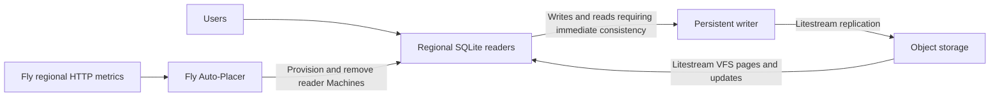

# Fly Auto-Placer

**Place disposable SQLite read replicas near demand on Fly.io.**

Fly Auto-Placer decides where to provision your reader fleet from recent regional HTTP traffic. The project focuses on apps that serve most requests from SQLite read replicas using **Litestream VFS**, with a persistent writer managed separately. Readers can appear where demand grows and be removed when demand subsides; their local database caches can be rebuilt from object storage.

The controller reads five-minute request counts, smooths observations, reconciles a selected Fly app/process group, and adds or removes regional placements within configured limits. The intended benefit is faster reads near users without manually maintaining the same reader footprint everywhere. Latency and cost benefits still need to be measured for each application.

## SQLite near users, one writer kept separate



The reference setup uses a **dedicated reader app** as the placement target. The writer, its volume, and its recovery policy stay outside the controller's scope. Reader Machines use disposable local caches or hydrated database copies and have no mounted volumes.

Litestream's [VFS read replicas](https://litestream.io/guides/vfs/) fetch and cache pages from object storage; optional [hydration](https://litestream.io/guides/vfs-hydration/) builds a complete local database and keeps it updated. Reads may lag the writer, and cold pages still incur storage latency. This architecture suits applications that perform mostly reads and can handle replication delay explicitly.

## What works today

| Capability | Status |
| --- | --- |
| Regional placement from recent HTTP traffic | Implemented, with authenticated control, protected regions, limits, persistent cooldowns, and reconciliation |
| Read-only regional traffic dashboard | Implemented; shows request demand, not database health |
| Local demonstration | Implemented with synthetic metrics and simulated actions |
| SQLite/Litestream reader application | Supplied by the operator today; a runnable reference app is planned |
| Real-metrics observe-only mode | Planned; current dry-run does not use real traffic |
| Replication freshness and warmup gates in placement decisions | Planned; the reader application must enforce its own readiness policy today |

The controller does not install Litestream, configure replication, route database writes, or manage the writer. Its metrics currently count **all HTTP requests to the target app**, not database reads or process-group-specific traffic. A dedicated reader app keeps that signal aligned with the fleet being placed.

Start with the [SQLite reader architecture and configuration guide](docs/sqlite-readers.md), the [example controller configuration](examples/sqlite-readers/placer-config.yml), and the [focused roadmap](FUTURE.md).

The default configuration uses **synthetic metrics and simulated actions**. Live mode must be enabled explicitly. The dashboard is read-only; placement runs through an authenticated API call.

## Start locally

Use Python 3.11 or 3.12 and Deno 2.9.7 on macOS/Linux, or use Docker. Poetry is no longer required.

1. Copy the environment examples:

   ```sh
   cp placer-service/.env.example placer-service/.env
   cp placer-dashboard/.env.example placer-dashboard/.env
   ```

2. Generate a token with `python3 -c 'import secrets; print(secrets.token_urlsafe(32))'`. Put the same value in both files as `PLACER_API_TOKEN`. Keep it private. Leave `dry_run: true` for the first run.
3. Start both apps:

   ```sh
   deno run -A local-dev.ts
   ```

The launcher creates a Python environment, installs the committed dependency locks, and starts the API on port 8000 and dashboard on port 8080. Open [the dashboard](http://localhost:8080). The YAML configuration is re-read and validated on each request; invalid settings stop that request without using the old configuration. Restart the processes after changing environment files or tokens.

To run with Docker instead, after configuring the same two environment files:

```sh
docker compose up --build
```

Compose binds both published ports to localhost and retains placement history in a named volume. Rebuild/recreate the service after changing the image's configuration file.

## Trigger a placement cycle

Export the same API token in your shell, then run:

```sh
curl --fail-with-body -X POST http://localhost:8000/trigger \
  -H "Authorization: Bearer $PLACER_API_TOKEN"
```

Each response includes the target, mode, current regions, completed actions, skipped actions with reasons, and any action errors. Dry-run actions are persisted separately and never invoke Fly.

- `GET /health`: public startup/configuration health, no credentials returned.
- `GET /metrics`: authenticated current regional counts and a dry-run indicator.
- `POST /trigger`: authenticated placement cycle.
- HTTP 401: missing/invalid token; 409: another cycle is running; 502: metrics, reconciliation, or an action failed; 503: invalid runtime configuration.

There is no background scheduler. Invoke `POST /trigger` from your scheduler once per minute for continuous operation. Do not overlap controllers: run **one placer replica per target app/process group**, with persistent data. The local file lock serializes requests and workers sharing that volume; it does not coordinate independent volumes.

## Enable live placement

For the SQLite architecture, select the dedicated reader app and keep the writer in a separate app. The target must already have at least one Fly Launch-managed Machine in the selected process group, created with `fly deploy`. Unmanaged Machines are excluded, matching Fly's scaling command. Only disposable process groups are supported; attached volumes cause the controller to stop without changing placement. Reader caches must be reconstructible from object storage.

Set these service environment variables:

| Variable | Purpose |
| --- | --- |
| `PLACER_API_TOKEN` | Random bearer token required by the controller API |
| `PLACER_TARGET_APP` | Exact reader application to scale; never the writer or controller |
| `FLY_API_TOKEN` | Fly token with permission to read metrics and scale that target |
| `FLY_PROMETHEUS_URL` | Organization metrics endpoint, e.g. `https://api.fly.io/prometheus/my-org` |

`FLY_APP_NAME` is **not** accepted as the live target: Fly injects the controller's own app name into that variable. Every scaling command explicitly selects `PLACER_TARGET_APP` and the configured process group.

In `placer-service/config/config.yml`, choose `process_group`, permitted regions, `always_running_regions`, and the region limits for your application. Then set `dry_run: false`. Live mode requires at least one protected region. Use an HTTPS metrics endpoint for a remote server.

The algorithm:

1. Reads actual regional Machine placement for the selected app/process group. Failed, transitional, or unknown Machine states block the cycle; stopped/suspended Machines count as provisioned placements that Fly may autostart.
2. Queries `sum(increase(fly_edge_http_responses_count{app="..."}[5m])) by (region)`.
3. Updates chronological short/long exponential averages using the configured sample windows.
4. Adds a region when its short average is at least `traffic_threshold`. The first high sample can trigger placement; sustained demand is not hidden by a rising threshold.
5. Removes a region only when both averages are at most `deployment_threshold`, cooldown has elapsed, and all region protections and minimum capacity checks permit it.

The thresholds are fixed configured request counts; smoothing and the gap between them provide hysteresis. The previous experimental volatility-based moving threshold was removed because it prevented initial and sustained-high-traffic scale-up.

Missing metrics are **unknown**, not zero. An empty result or failed query makes no infrastructure changes. A nonempty successful query may restore missing protected regions even when they have no regional traffic sample. Explicit zero observations can eventually remove an unprotected region.

Additions happen before removals. If an addition fails, or any protected region remains missing, removals are deferred. If required placements cannot be restored within `max_regions`, the cycle reports an error and makes no changes; increase the limit or reconcile placement manually. `min_regions` is a removal floor, not a target for adding arbitrary low-traffic regions.

`always_running_regions` protects regional **reader placement** from this controller's removals. It does not identify or protect a database writer, override Fly's own autostop/autostart configuration, or independently guarantee Machine health. Use the target application's Fly settings for those policies; keep writer management separate.

## State and recovery

State and traffic history live under:

```text
<data_dir>/<target-app>/<process-group>/
```

Dry-run and live files are separate. Writes use atomic replacement. Attempt timestamps are persisted before commands, and successful membership changes immediately afterward. A timeout can mean a Fly command partially applied; the next run reconciles actual Machines and retains cooldown before retrying.

Do not erase state to work around malformed files or cooldown. Inspect and repair the underlying issue. Reconciliation cannot recover lost cooldown timestamps. Keep a persistent volume and retain it across controller releases.

## Deploy the controller to Fly

The root `Dockerfile.fly` packages both processes, the pinned Fly CLI, and locked dependencies. The root `fly.toml` uses a private process-specific backend address on port 8000 and exposes the read-only dashboard over HTTPS.

1. Change the controller app name in root `fly.toml` and update `PLACER_SERVICE_URL` to `http://placer.process.<controller-app>.internal:8000`.
2. Create the controller app and the `placer_service_data` volume in its primary region.
3. Set `PLACER_API_TOKEN` as a Fly secret. For live operation, also set the three live-mode variables above as secrets/environment values.
4. Deploy with `fly deploy` and keep the `placer` process count at one.
5. Verify health and authenticated metrics before scheduling placement calls. The placer endpoint is private in the combined deployment; call it from within the Fly private network or through a local `fly proxy`.

The standalone service and dashboard Dockerfiles/Fly configurations are also supported. The standalone API requires the same bearer token. Set the dashboard's service URL to the reachable API address and give it the same controller token. The dashboard never forwards that token to the browser and cannot trigger scaling. Its regional traffic view is public wherever you expose the dashboard; restrict access at your network/authentication layer if needed.

Environment files, private keys, generated data, and logs are excluded from every Docker build context. Supply secrets at runtime.

## Verification and dependency maintenance

```sh
cd placer-service
python3.11 -m venv .venv
.venv/bin/python -m pip install --require-hashes -r requirements-dev.txt
.venv/bin/python -m pytest
```

The suite covers decision logic, authenticated requests, config reloads, state isolation, cooldown and recovery, protected/minimum/maximum regions, CLI target selection, malformed metrics, and repeated end-to-end placement cycles with Fly mocked.

The GitHub workflow tests Python 3.11/3.12 and builds all three images before deployment from `main`. Dependency versions and hashes are committed in `requirements*.txt` and `deno.lock`; the Python lock regeneration commands are in `pyproject.toml`.

Live operation still depends on your target app configuration, account permissions, metrics availability, and regional capacity. Local tests and container smoke checks do not substitute for a controlled first run against your chosen Fly application.

## License

MIT.
